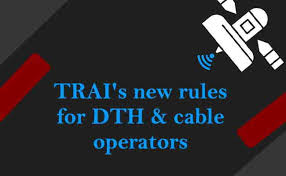

# DTHCableFeeComputation
DTH Cable Fee Analysis and Computation

# IMPACT ANALYSIS OF COST OF CABLE(DTH) FEES

  

## INTRODUCTION
The Telecom Regulatory Authority of India (TRAI) recently drafted new regulations and directed various DTH service providers and operators to implement them. These regulations were set up to ensure all operators in the DTH and cable ecosystem get a fair share of earnings. 
The immediate benefit will be passed to consumers as they get to choose what they want to watch and pay for it accordingly. The new plans are already in existence since February 1, 2019.

Though TRAI’s intent was to provide benefits to the Consumer, Service Providers and Broadcasters, but there has been a growing concern from the consumers around the increased cost of cable fees which they have to pay under the new cost structure.

-__Key concern :__ Why do we have to pay more now? 
  - It is estimated that the average cable fees was around 250 Rs where an consumer was able to watch all the channels. But now, consumers are complaining that now they have to more 2 to 4 times more for the same choice. 
  - Is this a fair deal?

An analysis was done on the Master Channel list to see what offerings are available in Pay and Free channels. And also to test TRAIs few recommendations like choosing your channels wisely and limited to 50 channels (as the survey suggests "around 90% of an average viewer does not watch more than 50 channels") and verify the below 2 primary concerns (by studying sample data - using live user selection), 
- can we beat (250 Rs) as this is the benchmark consumers have set(this is cable fee that they used pay)?
- Is it going to cost 2-4 times more as most of consumers fear?

## DATA
| Column Name         | Description                                               |
| ------------------- |:-------------                                             | 
| Pack_Name           | Channel Name                                              | 
| Pack_Value          | Monthly Cost                                              |  
| Monthly_Cost_in_Rs  | Cost per month                                            | 
| Choose_Yes_No       | Wishlist selection                                        |   
| Channel_Genre       | Genre - movies,music,sports,infotainment etc              |
| Channel_Language    | Primary Language                                          |
| Channel_Type        | Standard Definition(SD) or High Definition(HD)            |

## PROJECT ANALYSIS
| Description | Analysis |
| --- | --- |
| Channels_Data.head |  |
| Sample_Data |  |

### CONCLUSION

- From the analysis done it is deduced that the average cost would be around 340 Rs ( for an average of 28 paid channels selected with a Genre distribution of GEC (36%) ,Movies (14%) ,News (13%) ,Music (11%) ,Kids (12%) ,Infotainment (10%) ,Sports (3%) and Lifestyle (1%)).And keeping an variance of +/- 20% variance to get the range as __301.40 Rs to 370.40 Rs__.

- This indicates that the users will be seeing an increase in the cost of cable fees in the range of __50 Rs to 120 Rs__ when he is comparing it with his benchmark of __250 Rs__
 
- Below 2 options are suggested to help reduce this cost further.
   - Option 1 : As prescribed by TRAI – try to keep the channel list around 50. Filter out the list channels which are only absolutely needed and discard the ones which we seldom or rarely watch. This if done wisely can reduce the cost by 5-10 %. which means the 185 can be further reduced in the range of  __165 Rs__ (10%) to __175 Rs__(5%).

   - Option 2 : Use the pyPackRecommendation tool to achieve the benefits of using packs which offer lesser cost and try to reduce the cost by 10 to 20%. __140 Rs__(assuming a 20% reduction) to __158 Rs__(assuming a 10% reduction)__
The above 2 recommendations if implemented correctly would bring down the cost in the range of __295 Rs to 312 Rs__.  But, this is still an increase of 45 Rs to 60 Rs when compared with consumers benchmark of 250 Rs. 

- The final conclusion is that even after following TRAI's recommendation of keeping the channel count under 50 and using optimization tools such as pyPackRecommendation the user will still see an __increase cost of cable fees__ when he compares it with his benchmark of 250 Rs. However, it __will not increase 2-3 times more__ as feared if they follow TRAIs recommendation of chosing the right count of channels(around 50) and use the optimisation tools to further reduce the cost through Pack/Bouquet selections.

### FUTURE CONSIDERATIONS
Below are few impacts we see in future and study to conduct.

  - The cost is going to be playing a major role in customers choice of staying with a particular DTH or cable operator and once consumers realise the power of "Packs" and its benefits there will be natural migration to those DTH/Cable operator who offer wide variety (across languages and genre). One of the DTH operator who leads in the race is TataSky 
  - The consumers will also migrate to new DTH(Airtel,Tatasky etc ) if they dont provide transparency and ease of transactions. The worst affected will be the local cable operators as they are currently doing everything manual and this process takes a lot of time in implementing the new plans which is causing a heart burn among consumers. 
  - The above study was considered for south region, would like to do the same for north to see if there are major deviations which currently it is assumed to be none.
