# Breast cancer

### IMPACT ANALYSIS OF Lymph Nodes on Cancer

  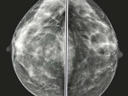

## INTRODUCTION
Breast cancer is cancer that develops from breast tissue. Signs of breast cancer may include a lump in the breast, a change in breast shape, dimpling of the skin, fluid coming from the nipple, a newly inverted nipple, or a red or scaly patch of skin.

__TNM staging system__ The most commonly used tool that doctors use to describe the stage of the cancer. Doctors use the results from diagnostic tests and scans to answer these questions: 

  __Tumor (T):__ How large is the primary tumor? Where is it located?
  __Node (N):__ Has the tumor spread to the lymph nodes? If so, where and how many?
  __Metastasis (M):__ Has the cancer spread to other parts of the body? If so, where and how much?
   The __“N”__ in the __TNM staging system__ stands for __lymph nodes__. 
  
  __Clinical staging:__ Evaluates the lymph nodes __before the surgery__, based on other tests and/or a physical examination.
  __Pathologic staging:__ Evaluates the lymph nodes __after the surgery__, which is a more accurate assessment.
  
      - NX: The lymph nodes were not evaluated.
      - N0: Either No cancer was found in the lymph nodes or Only areas of cancer smaller than 0.2 mm are in the lymph nodes.
      - N1: The cancer has spread to 1 to 3 axillary lymph nodes and/or the internal mammary lymph nodes.
      - N2: The cancer has spread to 4 to 9 axillary lymph nodes. Or it has spread to the internal mammary lymph nodes, but not the     axillary lymph nodes.
      - N3: The cancer has spread to 10 or more axillary lymph nodes. Or it has spread to the lymph nodes located under 
      
__Problem Statment :__ 
- How many survived after 5 years and how many died before 5 years?
- How the Positive axillary nodes (Pathologic staging) and survivals are related?
- How Survivals and Age and Axillary nodes are related?
- How the survivals and year of operation related?

## DATA
| Column Name             | Description                                                                                             |
| -------------------     |:-------------                                                                                           | 
| __Age__                 | Age of patient at time of operation (numerical)                                                         | 
| __Years_of_operation__  | Patient's year of operation (year - 1900, numerical)                                                    |  
| __Pos_axillary_nodes__  | Number of positive axillary nodes detected (numerical)                                                  | 
| __Status__              | Surival status (class attribute) (1=patient survived 5 years or longer,2=patient died within 5 year)    |     
## Data Profiling
- In the upcoming sections we will first __understand our dataset__ using various pandas functionalities.
- Then with the help of __pandas profiling__ we will find which columns of our dataset need preprocessing.
- In __preprocessing__ we will deal with erronous and missing values of columns. 
- Again we will do __pandas profiling__ to see how preprocessing have transformed our dataset.

## Data preparation
- There is no discrepancies found in the data 
- Year of operation is of two digits
- Found __44.4% zeros__ of __Pos_axillary_nodes__, but these are also __valid__ data, which indicates early stages of cancer – Either No cancer was found in the lymph nodes or only areas of cancer smaller than 0.2 mm are in the lymph nodes.
- Converted two digits year of operation to four digits
- Create additional column PAN_Stage which computes Pos_axillary_nodes and categorizes each patient with different pathological stages of cancer.
- Create Survival Bracket column 

  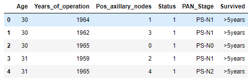

- __Count Plot:__ How many survived after 5 years and how many died before 5 years?

  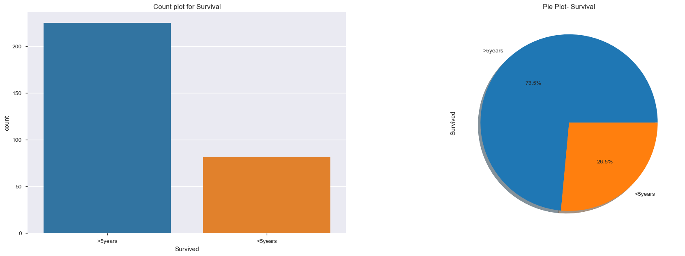
   Notice that more people survied more than 5 Years. 

- __Stacked Bar Plot:__ How the Positive axillary nodes (Pathologic staging) and survivals are related?

  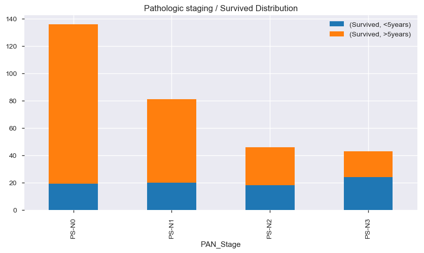
   
  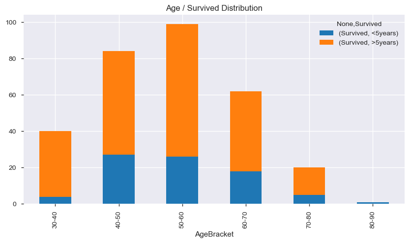

- __PIE Plot:__ Pathologic staging / Survived Distribution

  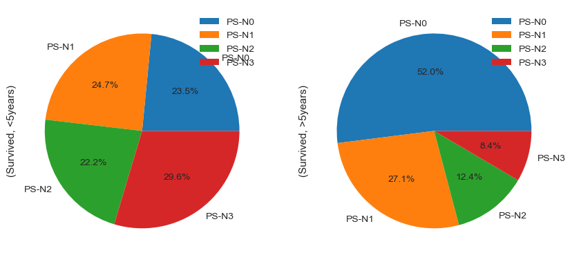
   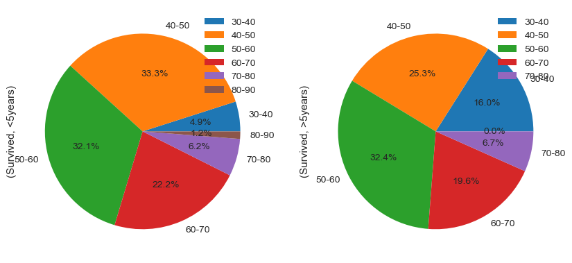

- __Swarm Plot:__ Pathologic staging / Survived Distribution

  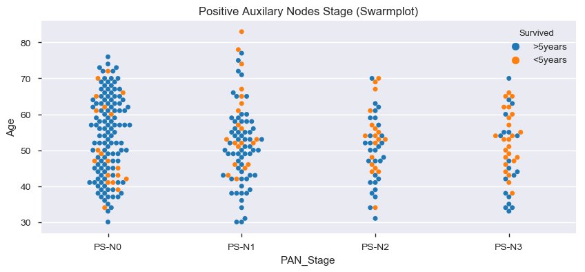
   
  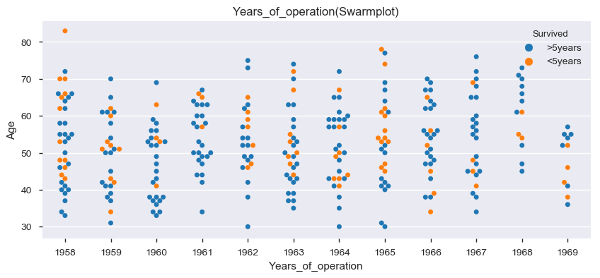
   
Swarm plot trend shows as the positive auxiliary nodes increase the survival rate decreases.
 We see the blue dots (>5years) predominating in the case where stage __increases from N0 to N3__
 And as the __stage increased from N0__ the __red__ dots started to outnumber the blue showing the __fall in the survival(<5years)__
 Majority of deaths happened between 1958 and 1966 after that there was decline for both (<5 and >5 years)

- __Violin Plot:__ Positive Axillary Nodes

  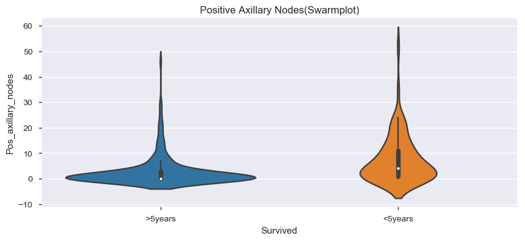
   
  VIOLIN plot shows clearly that women who couldn't survive <5 years after operation was due to the contraction of high positive axillary lymph nodes which decreased the chances of their survival.

- __Distribution Plot__

  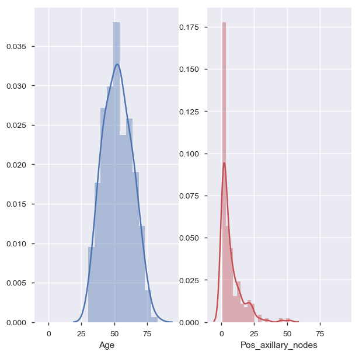
   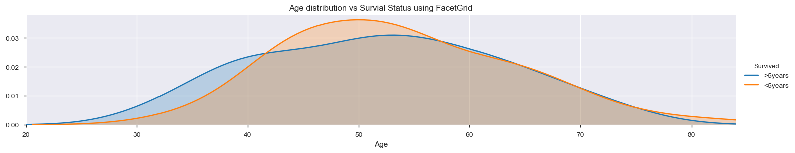
   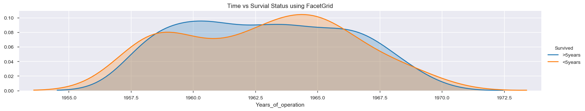
   
  The age is normally distributed whereas the positive axillary nodes is right skewed. 
  Age is normally distributed between >5year and <5years survivals and the mean is around 50 years for both. 
  Majority of deaths happened between 1959 and 1966 after that there was declined due to good invention of better medications for both (<5 and >5 years)

Notice  
- Rate of patients __survival is more when postivie axillary numbers are low in number, which means initital stages of patholigical stage__
- Rate of patients survival after 5 years __decreases__ as pathologic stage __progresess to next stage__
- Stage __N0 as better chance than N3__

- __Heat Plot:__ Pathologic staging / Survived Distribution

  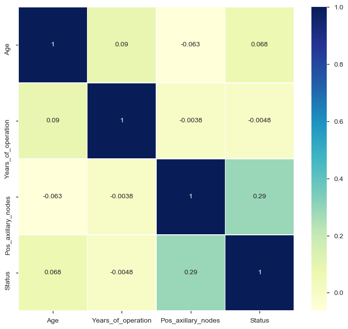
   
  There is positive correlation between Positive axillary nodes and Status(Survival) which is also proven by using the violin and swarm plot.

### CONCLUSION

